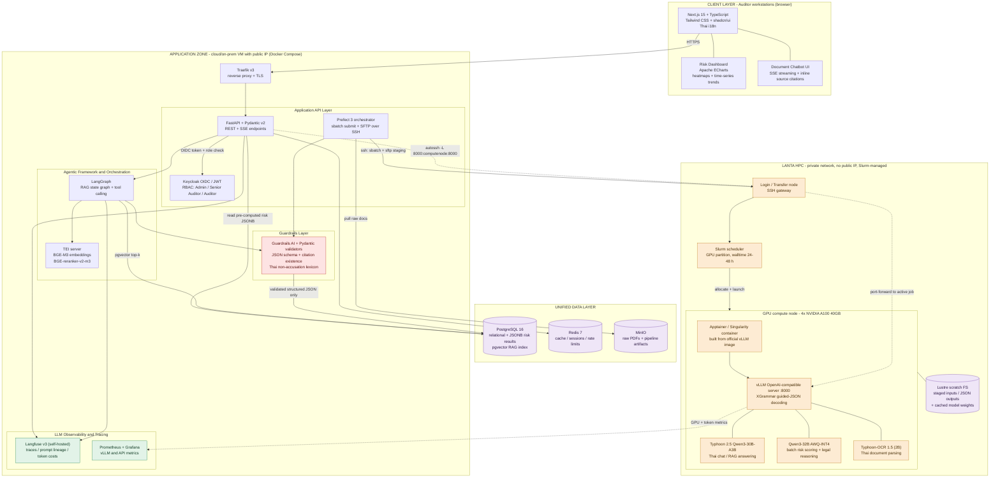
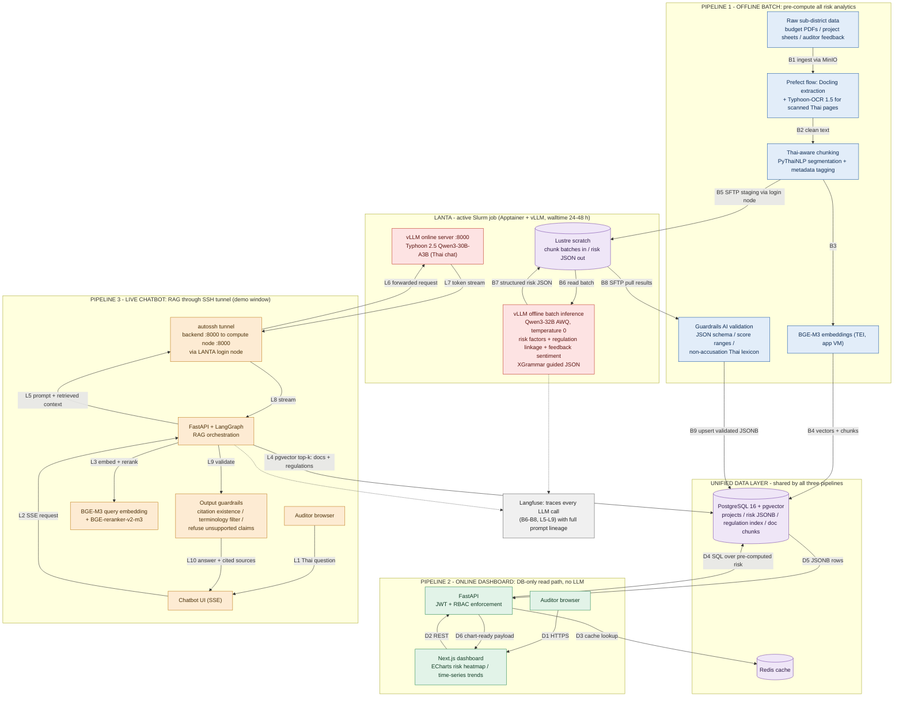
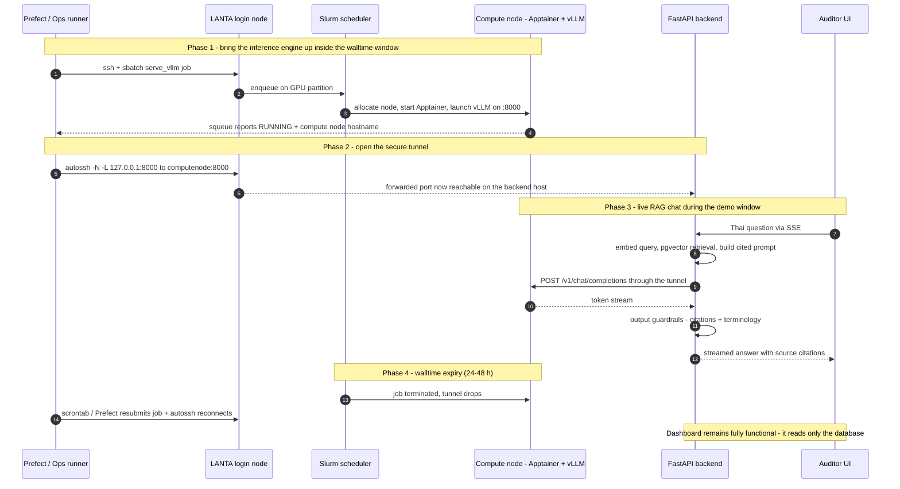

# Mission 3 — Local Budget Fraud Risk & Document Intelligence Assistant
## System Architecture & Data Flow Design (LANTA HPC Deployment)

---

## 1. Design Summary

The entire architecture is shaped by one hard constraint: **LANTA cannot host a permanent, publicly reachable API.** Compute nodes sit behind a private network with no public IP, are allocated only through Slurm, and are killed after a 24–48 h walltime. The design therefore splits the system into two planes:

**A permanently available Application Zone** — a small VM (cloud or on-prem) with a public IP running the frontend, API, RBAC, unified database, guardrails, and observability as a Docker Compose stack. This plane is up 24/7 and never depends on LANTA being alive.

**An ephemeral Inference Zone inside LANTA** — a Slurm job that launches an Apptainer container running vLLM on a 4× A100 GPU node for the duration of one walltime window. Everything expensive (risk scoring, regulation cross-referencing, feedback sentiment, OCR, document embedding source text) is **pre-computed in offline batch runs** and persisted as validated, structured JSON in PostgreSQL. The auditor-facing dashboard therefore renders instantly from the database and remains fully functional even when no LANTA job is running. Only the **live RAG chatbot** requires real-time inference, and it reaches the active compute node through an SSH tunnel opened via LANTA's login node during scheduled demonstration windows.

**Responsible AI is enforced structurally, not just by prompting:** the risk verdict field is a closed enum at the decoding level (via vLLM's XGrammar guided JSON), so the model is grammatically incapable of emitting "fraud"/"corruption" as a verdict; a post-hoc guardrails stage then re-validates schema, value ranges, citations, and a Thai/English non-accusation lexicon before anything is written to the database or streamed to a user. The human auditor always makes the final call.

---

## 2. Diagram 1 — System Architecture

**Reading the diagram.** Solid arrows are always-available paths; dotted arrows exist only while a Slurm job is alive (the tunnel and metric scraping). All inbound traffic terminates at the Application Zone — LANTA is only ever reached *outbound* over SSH (sbatch/SFTP from Prefect, port-forward from the API host), which is exactly what its network isolation permits.

---

## 3. Diagram 2 — Data Flow Diagram (Three Pipelines)

Edge labels are numbered per pipeline: **B1–B9** offline batch, **D1–D6** online dashboard, **L1–L10** live chatbot.

**Pipeline 1 — Offline Batch (the HPC strategy).** Prefect extracts raw project documents (Docling for born-digital PDFs, Typhoon-OCR 1.5 for scanned Thai pages), performs Thai-aware chunking with PyThaiNLP, and forks the flow: chunks are embedded with BGE-M3 on the app VM and written straight into pgvector (B3–B4), while analysis batches are staged over SFTP to LANTA scratch (B5). Inside the walltime window, the vLLM batch job computes risk factors, risk scores, regulation linkage (e.g., mapping findings to sections of the State Fiscal and Financial Discipline Act B.E. 2561), and auditor-feedback sentiment/concern tags — all as schema-locked JSON at temperature 0 (B6–B7). Each risk factor's output includes its typed reasoning chain (`reasoning_steps`: evidence → observation → interpretation) *inside* the guided schema, so the dashboard can show how the model reached a flag using only grammar-constrained, lexicon-validated text; the model's raw `<think>` trace is captured to Langfuse for debugging/audit and is never stored in `risk_results` or shown to users. Results are pulled back, pass Guardrails validation, and are upserted into PostgreSQL JSONB (B8–B9). Time-series and trend analytics are then plain SQL (window functions / materialized views) over the multi-year budget rows — no LLM in that path at all.

**Pipeline 2 — Online Dashboard (the stability strategy).** The request path is browser → FastAPI (JWT + RBAC) → Redis/PostgreSQL → chart-ready JSON. Because every number was pre-computed and validated in Pipeline 1, dashboard latency is milliseconds and completely decoupled from LANTA's job state.

**Pipeline 3 — Live Chatbot (the demo-window strategy).** The user's Thai question is embedded (BGE-M3), matched against both project-document and regulation collections in pgvector, reranked, and assembled into a citation-carrying prompt. The OpenAI-compatible call travels through an autossh local port-forward — backend `:8000` → login node → active compute node `:8000` — and tokens stream back over the same tunnel into the SSE response. Output guardrails verify that every citation refers to a genuinely retrieved chunk and that the terminology policy holds before the user sees the text.

---

## 4. Bonus Diagram — Chatbot Tunnel Lifecycle (Sequence)

This makes the walltime choreography explicit — how the tunnel is created, used, dropped, and re-established.

---

## 5. Recommended Production-Grade Tool Stack (per Logical Layer)

| Logical layer | Selected tool(s) | Strong alternative | Why this choice |
|---|---|---|---|
| **Client / Frontend** | Next.js 15 + TypeScript, Tailwind CSS + shadcn/ui, Apache ECharts | Streamlit (fastest throwaway prototype) | SSR dashboards, first-class SSE for streaming chat, ECharts renders dense Thai-labeled heatmaps/time-series well; ships as one Docker image |
| **Application API** | FastAPI + Pydantic v2 | NestJS | Async SSE streaming; one set of Pydantic schemas is reused by the API, the guardrails validators, and vLLM guided decoding; native Python ML ecosystem |
| **AuthN / RBAC** | Keycloak (OIDC + JWT); roles: Admin / Senior Auditor / Auditor | Authentik; plain FastAPI-JWT for the prototype | Production IdP with audit logging; role claims enforced per endpoint (e.g., only Senior Auditor can export or disposition flags) |
| **Pipeline orchestration** | Prefect 3 | Apache Airflow; bare `scrontab` | Lightweight Pythonic flows with retries/observability; a Prefect worker drives `sbatch`, `squeue` polling, and SFTP over SSH to the LANTA login node |
| **Unified data** | PostgreSQL 16 + pgvector + JSONB | Qdrant (only if vectors outgrow PG) | One ACID engine genuinely unifies relational project/budget data, validated risk JSON, and the RAG vector index — simplest possible ops surface |
| **Cache / sessions** | Redis 7 | Valkey | Dashboard hot-path caching, rate limiting, SSE session state |
| **Object storage** | MinIO | Local FS for the prototype | S3-compatible store for raw PDFs and batch artifacts |
| **Inference engine** | vLLM (OpenAI-compatible server + offline batch mode) inside Apptainer/Singularity on Slurm | SGLang | Highest-throughput open server; structured output via XGrammar guided JSON; Prometheus metrics endpoint; official Docker images convert cleanly to Apptainer SIF for LANTA |
| **Document parsing** | Docling + Typhoon-OCR 1.5 (vLLM-served) + PyThaiNLP | Marker; PyMuPDF | Layout-aware extraction; Typhoon-OCR is purpose-built for real-world Thai documents (forms, handwriting); PyThaiNLP gives correct Thai sentence segmentation before chunking |
| **Agentic framework** | LangGraph (with LlamaIndex retriever components) | Haystack 2 | Explicit, checkpointable state graphs; deterministic tool-calling; structured-output enforcement hooks; first-class Langfuse integration |
| **Embedding serving** | HF Text-Embeddings-Inference (TEI) hosting BGE-M3 + BGE-reranker-v2-m3 | Infinity | Runs on the app VM (CPU is enough at this scale), so retrieval never depends on LANTA being up |
| **LLM observability** | Langfuse v3 (self-hosted) + Prometheus/Grafana | Arize Phoenix; OpenLLMetry | Full prompt lineage, per-step traces, and token accounting kept on-prem (data sovereignty for audit material); Grafana scrapes vLLM metrics through the tunnel |
| **Guardrails** | vLLM XGrammar guided JSON (decode-time) + Guardrails AI validators (post-hoc) | NVIDIA NeMo Guardrails | Two-stage defense: the schema is enforced *while generating*; lexicon/citation/range checks then reject or repair outputs before DB write or user delivery |

---

## 6. LLM Model Recommendations (vLLM on LANTA, 4× A100 40 GB per node)

A100s are Ampere-class — they have **no FP8 tensor cores**, so FP8 checkpoints are out; the right quantization family here is **AWQ / GPTQ INT4 (Marlin kernels)** or plain BF16 where it fits. GGUF files are for llama.cpp — on vLLM, use the original safetensors or AWQ repos. Pre-download all weights to project storage on Lustre, since compute nodes have no internet access.

| Role | Model | Params | Format on A100 40 GB | GPU placement (one node) | Why it wins for this project |
|---|---|---|---|---|---|
| **Thai chat + live RAG answering** | `scb10x/typhoon2.5-qwen3-30b-a3b` | 30B MoE (~3B active) | BF16, tensor-parallel 2 | GPUs 0–1 | SCB 10X's flagship Thai instruct line, Apache-2.0, built on Qwen3-MoE — only ~3B active parameters means fast token streaming for a responsive chatbot, with strong Thai fluency and tool-calling support on vLLM |
| **Batch risk scoring + Thai legal reasoning (structured output)** | `Qwen/Qwen3-32B` (official AWQ-INT4) | 32B dense | AWQ-INT4 ≈ 19 GB | GPU 2 | Dense 32B gives the most careful multilingual reasoning per GPU for cross-referencing budget items against fiscal-discipline law; excellent JSON-schema adherence under XGrammar; Apache-2.0; mature, first-class vLLM support |
| **Thai document OCR / parsing (ingest)** | `scb10x/typhoon-ocr1.5-2b` | 2B VLM (Qwen3-VL base) | BF16 | GPU 3 | Purpose-built open Thai/English document parser (tables, forms, handwriting) with an official `vllm serve` path — turns scanned budget PDFs into clean markdown for chunking |
| **Embeddings (app VM, not LANTA)** | `BAAI/bge-m3` | 0.6B | FP16, CPU-capable | App VM (TEI) | The best-established multilingual retriever for Thai; hybrid dense+sparse retrieval suits legal text |
| **Reranker (app VM)** | `BAAI/bge-reranker-v2-m3` | 0.6B | FP16 | App VM (TEI) | Sharpens top-k precision on Thai legal/administrative passages before prompting |

**Fallbacks / alternates.** `scb10x/typhoon2.1-gemma3-12b` (dense Thai instruct, fits a single A100 in BF16) if MoE quantization or memory pressure becomes an issue; `openthaigpt` 1.5 or NECTEC's **Pathumma LLM** for a fully Thai-public-sector model lineage (the ThaiLLM ecosystem itself was developed on LANTA — a nice institutional fit); `google/gemma-3-27b-it` as a general multilingual fallback.

**Serving plan.** One Slurm job launches a single Apptainer SIF (built from the official vLLM image) that starts three vLLM server processes pinned with `CUDA_VISIBLE_DEVICES` as in the table. Risk-scoring calls run at temperature 0 with `guided_json` bound to the Pydantic-exported schema; the chat model serves `/v1/chat/completions` with streaming for the tunnel. Context length 16–32K covers chunked Thai legal documents comfortably within KV-cache budgets. At prototype scale (2–3 sub-districts, 10–20 projects) the Typhoon 2.5 model alone could handle every role — the two-model split is the production-grade pattern that keeps deep legal analysis and low-latency chat from competing for the same weights.

---

## 7. Responsible AI Enforcement Map ("flag, never accuse")

| Control point | Mechanism |
|---|---|
| **Prompt policy** | System prompts define the assistant as a risk-flagging aide for human auditors; neutral, non-accusatory phrasing is required; every output states that final judgment rests with the auditor |
| **Decode-time schema** | XGrammar guided JSON makes `risk_level` a closed enum — ต่ำ / ปานกลาง / สูง / ควรตรวจสอบเพิ่มเติม (Low / Medium / High / Requires Further Investigation). There is no free-text verdict field, so an accusation cannot be generated in that slot |
| **Post-hoc lexicon validator** | Guardrails AI rejects or re-asks on outputs containing accusatory terms used as conclusions (e.g., ทุจริต, โกง, ฉ้อโกง, "fraud", "corruption"), while still permitting them inside quoted regulation titles |
| **Citation existence check** | Every citation id in a chatbot answer must match a chunk actually retrieved for that query; otherwise the answer is regenerated or the claim is dropped — the primary anti-hallucination control |
| **Range/consistency validators** | Risk scores bounded 0–100; factor weights must sum correctly; regulation references must resolve to a known act/section in the regulation index |
| **Reasoning transparency** | The dashboard's "how the model got the answer" panel shows only the structured `reasoning_steps` chain (evidence → observation → interpretation) emitted inside guided JSON — every displayed word is grammar-constrained and lexicon-validated. The raw `<think>` trace is never user-facing; it lives in Langfuse only |
| **UI copy** | Dashboard labels are "High Risk / Anomaly / Requires Further Investigation" with a persistent disclaimer that a flag is not a finding |
| **Human-in-the-loop** | Auditors disposition every flag; their feedback is stored and analyzed (sentiment/concern) in the batch pipeline, closing the loop |
| **Audit trail** | Langfuse retains the full prompt lineage of every score and answer, so any flag can be reconstructed, explained, and challenged later |

---

## 8. How the Design Satisfies Each LANTA Constraint

**No public IP / private network.** Nothing ever connects *into* LANTA except SSH to the login node, which is the sanctioned access path. Users never touch LANTA; they touch the Application Zone.

**Slurm-only resource access.** Prefect submits `sbatch` scripts and polls `squeue` over SSH; the inference engine exists only as a scheduled job artifact (Apptainer SIF + job script), which also makes the deployment reproducible.

**24–48 h walltime kills.** The product does not care: dashboards read only PostgreSQL (Pipeline 2), and batch results were already validated and persisted (Pipeline 1). Only the chatbot needs a live job, and it is explicitly scoped to demonstration windows — `scrontab`/Prefect resubmits the job and autossh re-establishes the tunnel automatically, with model weights cached on Lustre so a cold restart takes minutes, not hours.

**No 24/7 endpoint inside compute nodes.** The stable, always-on OpenAI-compatible surface the application talks to is a *local forwarded port on the app VM*; the ephemeral thing behind it is swapped by the scheduler without the frontend ever knowing.

---

*Diagrams are written for Mermaid v10+ and can be pasted directly into mermaid.live, GitHub/GitLab markdown, Notion, or draw.io's Mermaid import. If any edit is made, keep node labels inside double quotes to stay parse-safe.*
