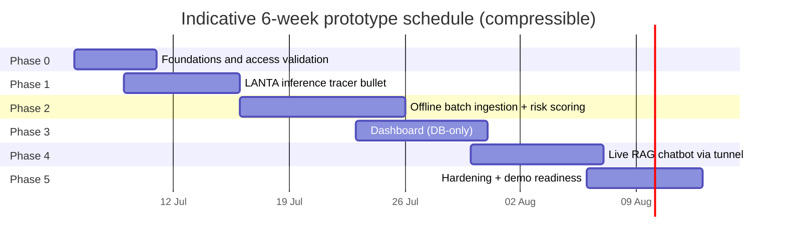

# Mission 3 — Phased Execution Roadmap
## Local Budget Fraud Risk & Document Intelligence Assistant

**Scope decision locked:** Marker and ApeRAG are rejected. The stack is the approved architecture — Next.js / FastAPI / LangGraph / PostgreSQL+pgvector / Prefect / Guardrails AI / Langfuse in the Application Zone; vLLM in Apptainer under Slurm on LANTA; Docling + Typhoon-OCR 1.5 for parsing.

---

## Guiding Principles

1. **Tracer bullet first.** The single project-killing risk is the LANTA lifecycle itself — Apptainer + Slurm + vLLM + SSH tunnel + walltime restarts. Prove that path end-to-end with a trivial payload *before* building any product feature on top of it.
2. **The product must not depend on LANTA being alive.** Build in an order where, at every phase gate, what exists so far still works when no Slurm job is running. Live inference is the *last* dependency added, not the first.
3. **Data before UI.** The dashboard is trivial to build once validated risk JSON exists in PostgreSQL; it is impossible to demo before that. So batch ingestion precedes frontend.
4. **One model until forced otherwise.** Start every phase with Typhoon 2.5 alone doing all jobs; introduce the second model (Qwen3-32B for batch scoring) only when batch quality tests justify the added serving complexity.

---

## Phase Overview

Phases deliberately overlap: Phase 2 (pipeline code on the app VM) can start while Phase 1 waits in the Slurm queue.

---

## Phase 0 — Foundations & Access Validation (~Week 1)

**Goal:** every account, quota, and network path we will later depend on is confirmed working — with zero product code written.

1. Confirm LANTA project allocation: GPU partition access, actual walltime limits on your tier, storage quota on Lustre project space, and Apptainer availability on compute nodes.
2. Validate the access mechanics by hand: SSH to the login node, `sbatch` a trivial GPU job (e.g., `nvidia-smi` inside a stock Apptainer image), SFTP a file in and out.
3. Provision the Application Zone VM; stand up the empty Docker Compose skeleton: Traefik, PostgreSQL 16 + pgvector, Redis, MinIO, Langfuse. No app services yet.
4. Create the repository, environment configs, and SSH key management for machine-to-LANTA automation (a dedicated deploy key, never personal credentials, stored as secrets on the app VM).
5. Assemble the mock corpus: 2–3 sub-districts, 10–20 projects, budget spreadsheets, and PDFs — deliberately including the nasty cases (scanned pages, legacy Thai fonts with garbled text layers) plus the regulation text (State Fiscal and Financial Discipline Act sections).

**Exit gate:** a GPU job runs on LANTA on demand; files move both directions; `psql` and MinIO respond on the app VM; the mock corpus is versioned in MinIO.

**Why first:** every later phase silently assumes these paths work. Discovering a quota or partition problem in week 4 is a schedule disaster; discovering it in week 1 is an email to ThaiSC support.

---

## Phase 1 — LANTA Inference Tracer Bullet (~Weeks 1–2) — THE risk-retirement phase

**Goal:** a Thai token stream generated on a LANTA compute node arrives at the Application Zone VM through the tunnel, and schema-locked JSON generation is verified. Nothing else.

1. Build the Apptainer SIF from the official vLLM image (build on the login node or build locally and SFTP the SIF).
2. Pre-stage model weights to Lustre project storage from the transfer node (compute nodes have no internet): Typhoon 2.5 Qwen3-30B-A3B first; Typhoon-OCR 1.5 second; Qwen3-32B AWQ deferred to Phase 2 if needed.
3. Write the serving Slurm job: launch vLLM OpenAI-compatible server on :8000, log the compute-node hostname. Verify with a local request from the login node.
4. Open the autossh local port-forward from the app VM through the login node to the compute node; verify a streamed Thai chat completion end-to-end from the app VM.
5. Verify structured output: send a request with a `guided_json` schema (a draft Pydantic risk schema) at temperature 0; confirm the enum-locked `risk_level` behaves as designed.
6. Test vLLM offline batch mode inside a job (file in on Lustre → JSON out) — this is the Pipeline-1 primitive.
7. Automate the lifecycle: `scrontab` or a Prefect flow that resubmits the job on expiry and re-establishes the tunnel; run a deliberate kill-and-recover drill and time it.

**Exit gate:** cold restart (job resubmission → weights loaded from Lustre → tunnel reopened → first token) completes in a known, scripted time (target: minutes); tokens/sec and guided-JSON reliability are measured and written down.

**Why now:** this is the only part of the system nobody on the team has proven before. If the tunnel or walltime pattern fails here, the fallback (batch-only system with a pre-recorded chat demo) is a small pivot in week 2 and a fatal one in week 5.

---

## Phase 2 — Offline Batch Ingestion & Risk Pre-Computation (~Weeks 2–3)

**Goal:** one command turns the raw mock corpus into validated, structured risk JSON and a searchable vector index in PostgreSQL. This is the backbone of the entire product.

1. Design the PostgreSQL schema: sub-districts, projects, budget lines, documents, chunks (pgvector), regulations, `risk_results` (JSONB), auditor feedback. Freeze the Pydantic risk schema — it is the contract between batch job, guardrails, database, and dashboard.
2. Build the Prefect ingestion flow on the app VM: Docling extraction → garbled-text detection → route scanned/suspect pages to Typhoon-OCR (running on LANTA via the Phase-1 endpoint) → PyThaiNLP chunking with metadata → BGE-M3 embeddings via TEI → pgvector upsert. Ingest the regulation corpus as its own collection.
3. Run a parsing quality review on the nasty Thai PDFs and fix routing thresholds now — bad text discovered after indexing poisons everything downstream.
4. Build the risk-scoring batch: prompt templates per risk factor (budget deviation, vendor concentration, timeline anomalies, threshold-splitting patterns, document completeness), regulation cross-referencing, and auditor-feedback sentiment — all via guided JSON at temperature 0, staged over SFTP, executed inside the walltime window.
5. Build the Guardrails validation stage (schema, score ranges, non-accusation lexicon, regulation references resolve) as the *only* write path into `risk_results`.
6. Wire Langfuse tracing into every batch LLM call from day one — retrofitting observability is miserable.
7. Decision point: evaluate Typhoon 2.5's scoring quality on a labeled sample; add Qwen3-32B AWQ as the batch analyst only if it measurably wins.

**Exit gate:** full corpus re-processes idempotently with one command; every project has validated risk JSON in PostgreSQL; retrieval spot-checks on Thai queries return sensible chunks.

---

## Phase 3 — Dashboard on Pre-Computed Data (~Weeks 3–4)

**Goal:** the auditor-facing product is fully usable with LANTA completely offline.

1. FastAPI read endpoints over `risk_results` and budget tables, with JWT auth and simple role checks (Auditor / Senior Auditor / Admin). Start with FastAPI-native JWT; keep Keycloak as a documented upgrade path rather than a week-3 dependency.
2. Next.js dashboard: portfolio risk overview (heatmap), project drill-down with factor breakdown and linked regulation sections, time-series/trend views (SQL window functions — no LLM), and the feedback-sentiment panel.
3. Redis caching on hot endpoints.
4. Responsible-AI UI copy everywhere: flags are "High Risk / Anomaly / Requires Further Investigation," never verdicts; persistent disclaimer that the auditor decides.

**Exit gate:** demo the dashboard with all Slurm jobs killed. If it degrades at all, Phase 3 is not done.

**Why after Phase 2:** a dashboard mocked against fake data always gets rebuilt; a dashboard built against the real frozen schema gets shipped.

---

## Phase 4 — Live RAG Chatbot Through the Tunnel (~Weeks 4–5)

**Goal:** cited, guarded, streaming Thai Q&A over project documents and regulations during demo windows.

1. Implement the LangGraph flow: query embedding → pgvector top-k over documents *and* regulations → BGE-reranker → prompt assembly with citation IDs → streamed call through the tunnel → output guardrails (citation-existence check, terminology lexicon, refuse-when-unsupported) → SSE to the client.
2. Chat UI with inline citations and a source-passage viewer, so auditors can verify every claim in one click.
3. Graceful-degradation state: when the tunnel is down, the chatbot explicitly says the live assistant is outside its demonstration window and points to the dashboard — the walltime constraint becomes a designed behavior, not a bug.
4. Langfuse tracing on the full chat path; capture retrieval sets alongside generations so citation failures are debuggable.

**Exit gate:** ten scripted Thai auditor questions answered with verifiable citations; kill the Slurm job mid-session and confirm the UI degrades exactly as designed.

---

## Phase 5 — Hardening & Demo Readiness (~Weeks 5–6)

**Goal:** the system survives an adversarial reviewer and a live demo.

1. Guardrails red-team: attempt to elicit accusatory language, fabricated citations, and out-of-scope legal conclusions; freeze the adversarial prompts into a regression suite that runs against every prompt or model change.
2. Observability finish: Grafana dashboards for vLLM (through the tunnel) and API latency; alert on tunnel loss.
3. Ops runbook: demo-window checklist (submit job → verify tunnel → smoke test), recovery drill timings from Phase 1, and the resubmission automation under supervision.
4. RBAC finalization and audit logging review (Keycloak now, if time allows and the demo needs multi-role storytelling).
5. Demo narrative: seed one mock project with a clear, explainable high-risk story (e.g., repeated purchases just under a procurement threshold) so the factor breakdown, regulation link, and chatbot citation all land in one flow.
6. Stretch goals only if green elsewhere: PostgreSQL full-text search with Thai tokenization for hybrid retrieval; regulation-linkage graph as plain PG tables built by the batch job.

**Exit gate:** a full dress rehearsal — batch rerun, dashboard tour, live chat inside a real walltime window, one deliberate failure and recovery — executed by a team member who didn't build that component.

---

## Deliberately Deferred (and why)

| Deferred item | Reason |
|---|---|
| Keycloak on day one | An IdP is an upgrade, not a foundation; simple JWT unblocks Phases 3–4 without a new stateful service |
| Second LLM (Qwen3-32B) | Only earns its GPUs if Typhoon 2.5 measurably underperforms on scored samples (Phase 2 decision point) |
| Elasticsearch / GraphRAG | Rejected with ApeRAG; hybrid needs are covered by PG full-text + graph-as-tables stretch goals |
| Kubernetes / autoscaling | Docker Compose is correct at prototype scale; the HPC side is already "scheduled" by Slurm |
| Fine-tuning any model | Prompting + guided decoding must be exhausted first; fine-tuning is a post-prototype conversation |

---

## Risk Register → Phase That Retires It

| Top risk | Retired by |
|---|---|
| Tunnel / walltime lifecycle doesn't work in practice | Phase 1 (tracer bullet + recovery drill) |
| Thai parsing garbage poisons the index | Phase 2, step 3 (quality gate before mass indexing) |
| LLM emits accusatory or unschema'd output | Phase 1 step 5 (decode-time) + Phase 2 step 5 (validators) + Phase 5 red-team |
| Demo fails because LANTA queue is congested | Phases 2–3 (everything user-facing except chat runs from the database) |
| Hallucinated citations in the chatbot | Phase 4 (citation-existence guardrail + source viewer) |
| Model weights can't be fetched on compute nodes | Phase 1, step 2 (pre-staging to Lustre is the standard workflow) |

---

## Definition of Done (prototype)

The prototype is done when: (1) the full mock corpus re-processes with one command; (2) the dashboard demos flawlessly with zero running Slurm jobs; (3) the chatbot answers Thai questions with verifiable citations inside a walltime window and degrades gracefully outside it; (4) the red-team regression suite passes; and (5) someone other than the author can execute the demo-window runbook.
